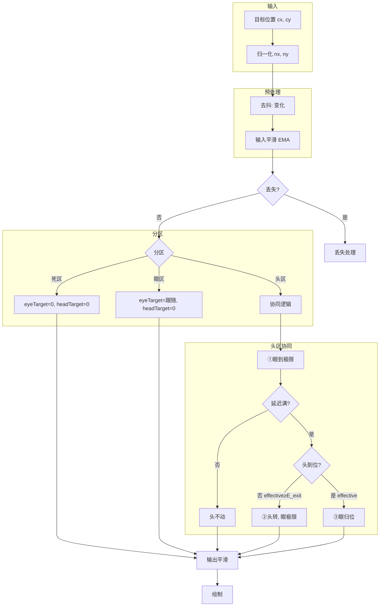

# Motion Eye 眼-体协同机制设计

本文档描述**眼-头协同跟随**的设计逻辑，与 demo 实现解耦。

---

## 一、整体管线

```
输入(cx,cy) → 归一化(nx,ny) → 去抖 → 输入平滑(EMA) → 分区 → 目标生成 → 输出平滑 → 绘制
                                                      ↓
                                              丢失检测 → 丢失处理
```

---

## 二、分区设计

基于归一化坐标 `(nx, ny)`，将视野划分为三个区域：

| 区域 | 条件 | 行为 |
|------|------|------|
| **死区** | \|nx\| < δ 且 \|ny\| < δ | 中心小方块，不跟随，眼/头归零 |
| **眼区** | δ ≤ \|nx\| < θ_head | 仅眼动，头保持 |
| **头区** | \|nx\| ≥ θ_head | 眼+头协同（见下） |

- δ：死区半径（中心小方块边长的一半）
- θ_head：头区阈值，眼接近极限时才触发转头

---

## 三、眼-头协同机制（核心设计）

当目标进入**头区**时，采用「眼先动 → 延迟 → 头转 → 眼归位」四阶段：

```
┌─────────────────────────────────────────────────────────────────────────────┐
│                        头区协同流程                                          │
├─────────────────────────────────────────────────────────────────────────────┤
│                                                                             │
│  ① 眼先动          ② 延迟              ③ 头转              ④ 眼归位        │
│  ─────────         ─────────           ─────────           ─────────        │
│  眼快速到极限       眼保持极限           头向目标转动         眼按旋转后      │
│  (±eyeMax)         头不动              头到位后            坐标归位         │
│                     T_delay ms                                             │
│                                                                             │
└─────────────────────────────────────────────────────────────────────────────┘
```

### 3.1 阶段说明

| 阶段 | 眼 | 头 | 判定条件 |
|------|-----|-----|----------|
| ① 眼先动 | 到极限 ±eyeMax | 不动 | 进入头区，延迟计时未满 |
| ② 延迟 | 保持极限 | 不动 | 计时 < T_delay |
| ③ 头转 | 保持极限 | 向目标角度转动 | 计时 ≥ T_delay，且 \|effective_nx\| ≥ E_exit |
| ④ 眼归位 | 按旋转后坐标移动 | 继续向目标转动 | \|effective_nx\| < E_exit，头已到位 |

### 3.2 旋转后坐标（effective）

头转动后，目标在**头坐标系**中的位置：

```
effective_nx = nx - headYaw / headMaxDeg
effective_ny = ny   （水平旋转不影响垂直）
```

- 头转向目标时，目标在视野中更居中，effective_nx 趋近 0
- 当 \|effective_nx\| < E_exit 时，认为头已到位，眼可归位

### 3.3 设计要点

1. **眼先动**：符合人眼快速、头部慢速的生理特性
2. **延迟**：避免目标小幅波动时频繁转头
3. **眼归位**：头转后，眼按旋转后坐标跟随，而非立即回正

---

## 四、流程图（Mermaid）



---

## 五、丢失处理

目标丢失（如出框、检测失败）时：

| 阶段 | 行为 |
|------|------|
| look_last | 保持最后眼/头姿态一段时间 |
| pause | 静止等待 |
| return | 眼、头平滑归零 |

---

## 六、参数映射（设计 → Demo）

| 设计概念 | Demo 参数 |
|----------|-----------|
| δ 死区半径 | 0.12 |
| θ_head 头区阈值 | zone_head_min (0.75) |
| T_delay 延迟 | head_delay_ms |
| E_exit 头到位阈值 | E_exit (0.25) |
| 眼极限 | eyeMaxPx (±30) |
| 头极限 | headMaxDeg (±30°) |
